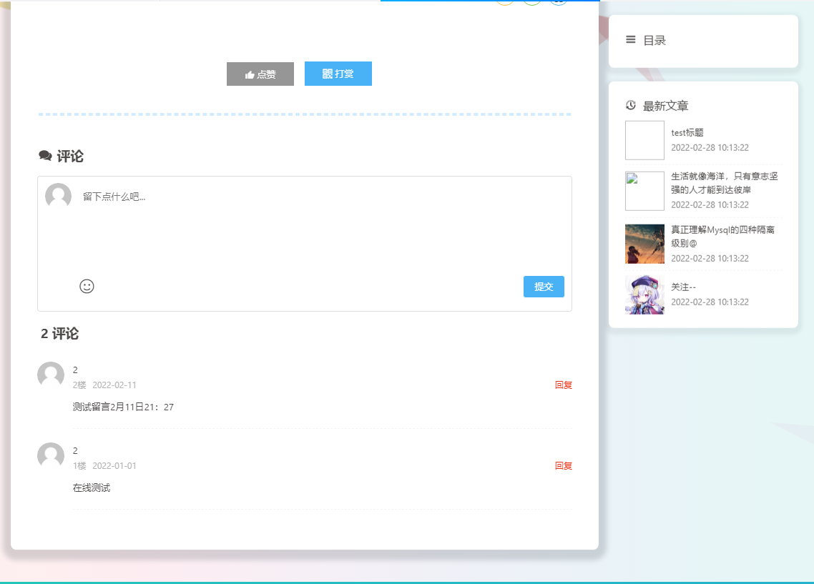

### hrdate-My-VueBlog

前后端分离的个人博客，主要采用Vue前/后台+Java的Spring boot框架整合其他...

前端技术：Vue，Vuex，Vue-Route，Webpack，Element-UI，MakerDown，SCharts

后端技术SpringBoot2.0，Mybatis-Plus，MySQL，Redis，Shiro整合JWT~~（后期应该还会加上RabbitMQ）~~

该练习项目还正在处于待完善阶段，且被个人当作实战练习方案，后续还会继续补补和添加功能

前台页面部分展示：http://www.hrdate.top/ ~~(我还没备案QAQ...)~~

功能：

- [ ] 文章分享打赏
- [ ] 文章增删改查
- [ ] 用户注册和修改密码(邮箱验证码)
- [ ] 用户文章点赞
- [ ] 用户文章/友链评论
- [ ] 用户/游客弹幕留言
- [ ] 用户单次会话浏览量统计和ip等其他基本信息
- [ ] 网站/文章浏览量统计
- [ ] 音乐播放器
- [ ] MySQL模糊查询搜索文章~~(有能力可以考虑换成ES)~~
- [ ] 后台AOP日志操作模块
- [ ] 后台评论/留言审核功能
- [ ] 修改网站公告等配置信息
- [ ] 后台使用SCharts渲染文章排名表和最近浏览量情况
- [ ] spring scheduled定时任务缓存数据一致性同步和统计网站流量

.....

### 前台展示

主页

归档

标签

标签文章列表

友链

文章评论板块

留言板

用户登录弹窗

用户注册弹窗

用户忘记密码弹窗

登录后进入到个人中心

### 后台展示

使用V-Scharts统计部分信息

标签管理

留言/评论管理

友链管理

操作日志

网站基本配置信息

### 项目借鉴

[MarkerHub](https://juejin.cn/post/6844903823966732302#heading-0)

[风丶宇](https://github.com/X1192176811/blog)

